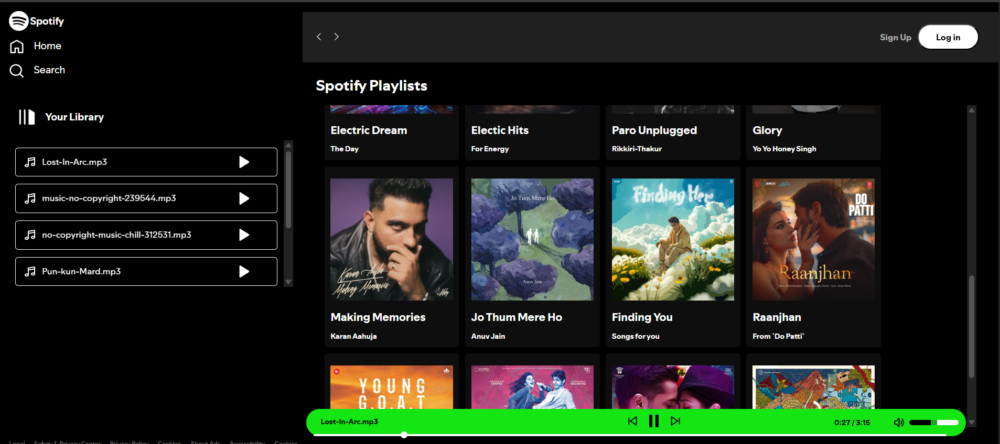

# Spotify-Clone

A sleek, responsive music player web app built with HTML, CSS, and JavaScript, inspired by Spotify.
It allows you to browse albums, play songs, control volume, seek tracks, and enjoy a smooth mobile experience!

# 🚀 Features

📁 Dynamic Album Listing — Albums are loaded automatically from folders containing songs and metadata.

🎶 Play, Pause, Next, Previous controls for seamless listening.

🎚 Volume Control — Including mute/unmute and slider control.

📈 Seekbar & Track Progress — Allows you to scrub through the song.

📱 Responsive Design — Works great on desktop, tablet, and mobile.

🎨 Hover Animations — Smooth UI effects on cards and play buttons.

📂 Folder-Based Music System — No need to hardcode each song.

# 🛠 Technologies Used

- HTML5 — Markup structure

- CSS3 — Styling and responsive layouts

- JavaScript (Vanilla) — Dynamic functionality and interactivity

- Fetch API — To load albums and songs dynamically

# 📸 Screenshots


- Song playing




# ⚙ How To Run Locally

- Clone the repository
```
git clone https://github.com/your-username/spotify-clone.git
```

- Navigate into the project folder
```
cd spotify-clone
```
- Start a local server

Open your browser and go to http://127.0.0.1:5500/ (or whatever port your server suggests).

# 📢 Important Notes

- Songs and albums must be organized properly inside the /songs folder.

- Each album folder must contain:

- cover.png — Album cover image

- info.json — Metadata file with:

{
  "title": "Album Title",
  "description": "Album Description"
}

- MP3 files inside.

- Make sure paths to images and music files are correct when hosting the project!

# 📜 License

This project is open-source and free to use for educational purposes - MIT lisense.


